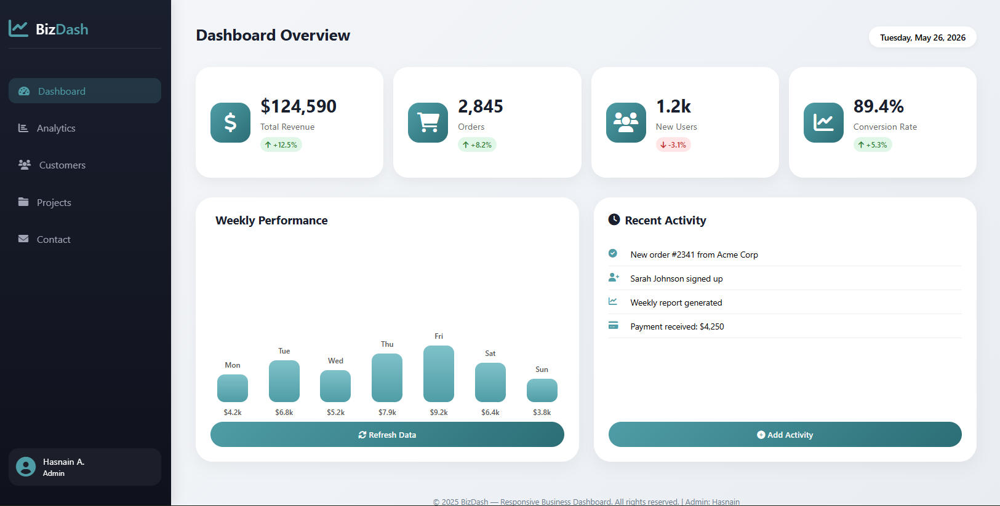
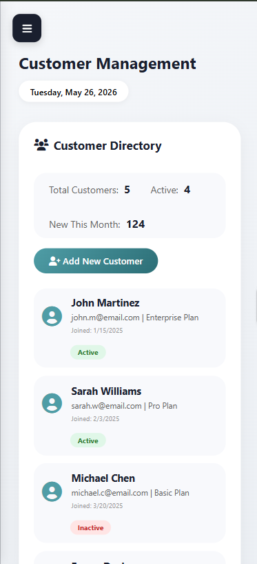
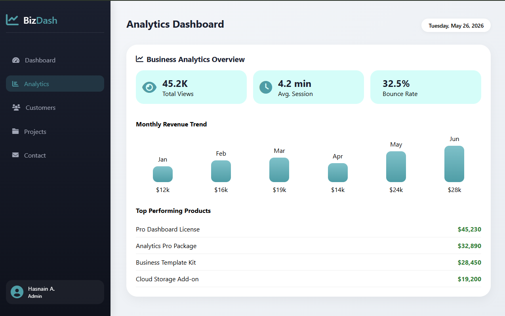
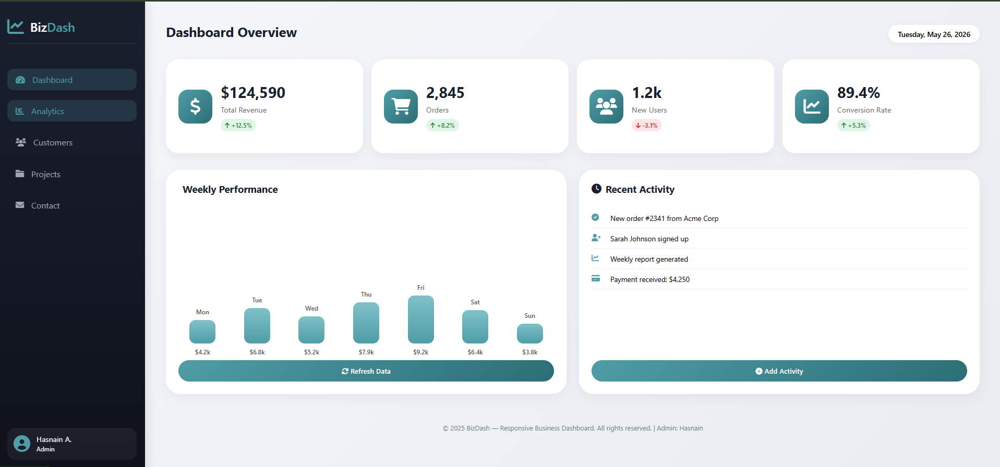
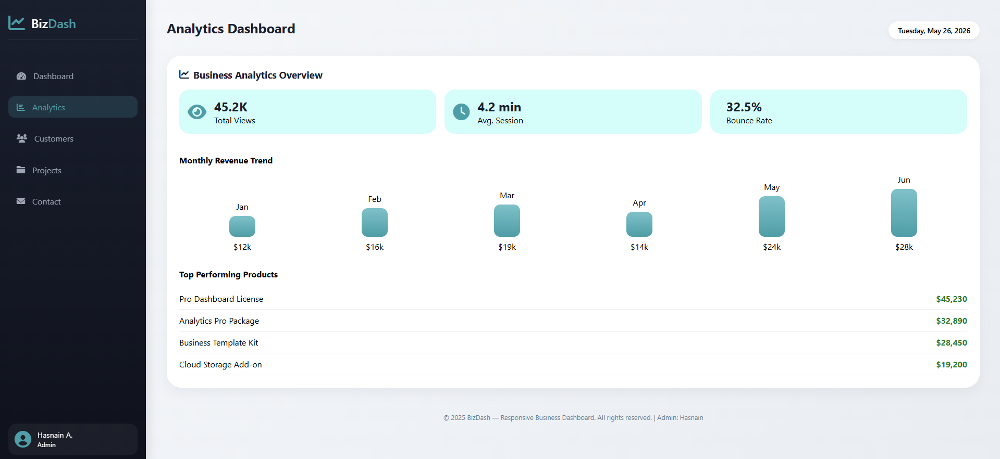
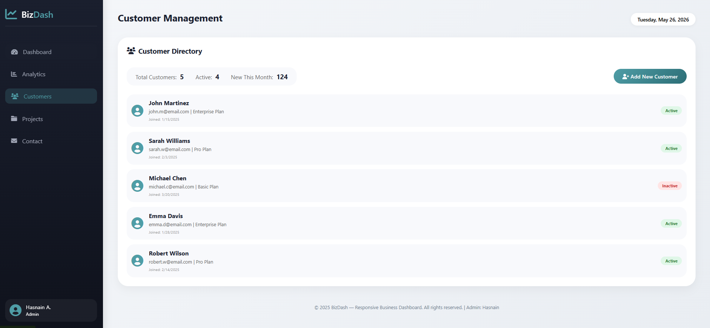
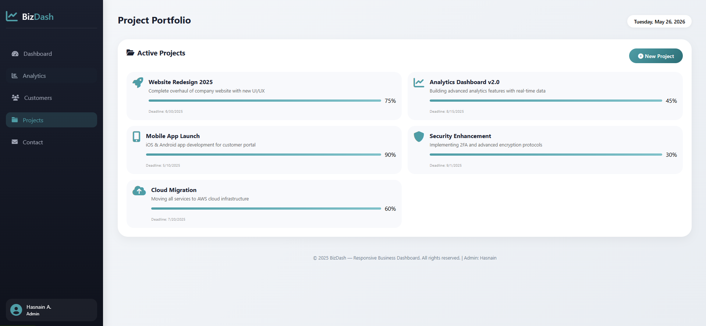
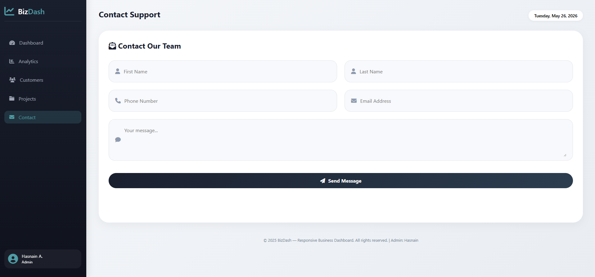

# 🚀 BizDash - Responsive Business Dashboard


## 📌 Overview

**BizDash** is a modern, fully responsive business dashboard interface built with **pure HTML5, CSS3, and vanilla JavaScript**. It provides a complete admin panel experience with dynamic content management, analytics visualization, customer tracking, project management, and a contact system — all with a beautiful teal/navy gradient color scheme.

🔗 **Live Demo:** [View Demo](https://your-username.github.io/BizDash-Responsive-Dashboard/)

---

## 📸 Screenshots

### 🖥️ Desktop View


### 📱 Mobile View


### 📟 Tablet View


### 📊 Dashboard Page


### 📈 Analytics Page


### 👥 Customers Page


### 📁 Projects Page


### 📧 Contact Page


---

## ✨ Features

### 📊 Dashboard Page
- Real-time statistics cards (Revenue, Orders, Users, Conversion Rate)
- Interactive weekly performance chart with bar visualization
- Recent activity feed with dynamic addition
- One-click chart data refresh with toast notifications
- Live date display

### 📈 Analytics Page
- Key performance indicators (Total Views, Avg Session Time, Bounce Rate)
- Monthly revenue trend visualization with animated bars
- Top performing products list with sales figures

### 👥 Customers Page
- Complete customer directory with profile cards
- Customer status badges (Active/Inactive)
- Real-time customer count statistics (Total, Active, New)
- Add new customers via modal form with fields:
  - Full Name
  - Email Address
  - Plan Selection (Basic/Pro/Enterprise)
  - Join Date
  - Status (Active/Inactive)
- Form validation and success notifications

### 📁 Projects Page
- Project portfolio with progress bars
- Project details including description and deadlines
- Add new projects dynamically
- Visual progress tracking with percentage display

### 📧 Contact Page
- Fully validated contact form with fields:
  - First Name
  - Last Name
  - Phone Number
  - Email Address
  - Message
- Success/error feedback messages
- Toast notification on successful submission

### 🎨 UI/UX Highlights
- Modern gradient color scheme (Teal + Navy)
- Smooth animations and hover effects
- Card-based layout with subtle shadows
- Toast notifications instead of browser alerts
- Modal dialogs for better user experience
- Clean and professional typography

---

## 🛠️ Technologies Used

| Technology | Purpose |
|------------|---------|
| **HTML5** | Semantic page structure |
| **CSS3** | Styling, Flexbox, Grid, Gradients, Animations |
| **JavaScript (ES6)** | DOM manipulation, dynamic content, modals |
| **Font Awesome 6** | Professional icon library |
| **Git & GitHub** | Version control and hosting |

---

## 📱 Responsive Breakpoints

| Device | Breakpoint | Layout Features |
|--------|------------|-----------------|
| **Mobile** | < 768px | Single column, hamburger menu, stacked cards |
| **Tablet** | 768px - 1024px | 2 columns, sidebar visible, optimized spacing |
| **Desktop** | > 1024px | 4 columns, full layout, fixed sidebar |

---

## 📂 File Structure
BizDash-Responsive-Dashboard/
│
├── index.html # Main HTML structure
├── style.css # All styling (responsive + animations)
├── main.js # All JavaScript functionality
│
├── screenshots/ # Project screenshots folder
│ ├── analytics.png
│ ├── contact.png
│ ├── customers.png
│ ├── dashboard.png
│ ├── desktop-view.png
│ ├── mobile-view.png
│ ├── projects.png
│ └── tablet-view.png
│
├── assets/ # (Optional) Additional images/icons
│
└── README.md # Project documentation

text

---

## 🚀 Installation & Setup

### 1. Clone the repository
```bash
git clone https://github.com/your-username/BizDash-Responsive-Dashboard.git
2. Navigate to project folder
bash
cd BizDash-Responsive-Dashboard
3. Open with Live Server
bash
# Using VS Code Live Server extension
# OR simply open index.html in your browser
4. No build steps required! Works out of the box.
🎯 How to Use
Dashboard Page
View key business metrics at a glance

Click "Refresh Data" to update chart with new values

Click "Add Activity" to simulate new system activities

Analytics Page
Navigate via sidebar to view analytics

Review KPI cards for business insights

Check monthly revenue trends and top products

Customers Page
Browse existing customer directory

Click "Add New Customer" to open modal form

Fill customer details and click "Done" to add

Customer count updates automatically

Projects Page
View active projects with progress bars

Click "New Project" to add a project dynamically

Track project deadlines and completion percentages

Contact Page
Fill all required fields

Submit form for validation

Receive success/error feedback

🎨 Color Scheme
Color Name	Hex Code	Usage
Primary Teal	#4f9da6	Icons, active states, gradients
Dark Teal	#2c6e76	Buttons, hover states, dark gradients
Navy Blue	#1a1f2e	Sidebar background, headings
Dark Navy	#0f121c	Sidebar gradient end
Light Gray	#f5f7fa	Body background start
Darker Gray	#e9edf2	Body background end
White	#ffffff	Cards, forms, modals
Success Green	#2e7d32	Positive trends, active status
Error Red	#c62828	Negative trends, inactive status
Medium Gray	#666666	Secondary text
Light Border	#e0e4e8	Input borders, dividers
Gradient Combinations Used
css
/* Sidebar Navigation */
linear-gradient(180deg, #1a1f2e 0%, #0f121c 100%)

/* Body Background */
linear-gradient(135deg, #f5f7fa 0%, #e9edf2 100%)

/* Primary Buttons & Icons */
linear-gradient(135deg, #4f9da6, #2c6e76)

/* Progress Bars */
linear-gradient(90deg, #4f9da6, #7fc1c9)
🔧 Browser Support
Browser	Version	Status
Chrome	60+	✅ Fully Supported
Firefox	60+	✅ Fully Supported
Safari	12+	✅ Fully Supported
Edge	79+	✅ Fully Supported
Opera	50+	✅ Fully Supported
Mobile Browsers	Latest	✅ Fully Supported
👨‍💻 Author
Hasnain A.

GitHub: @hasnaainali

Project Link: https://github.com/your-username/BizDash-Responsive-Dashboard