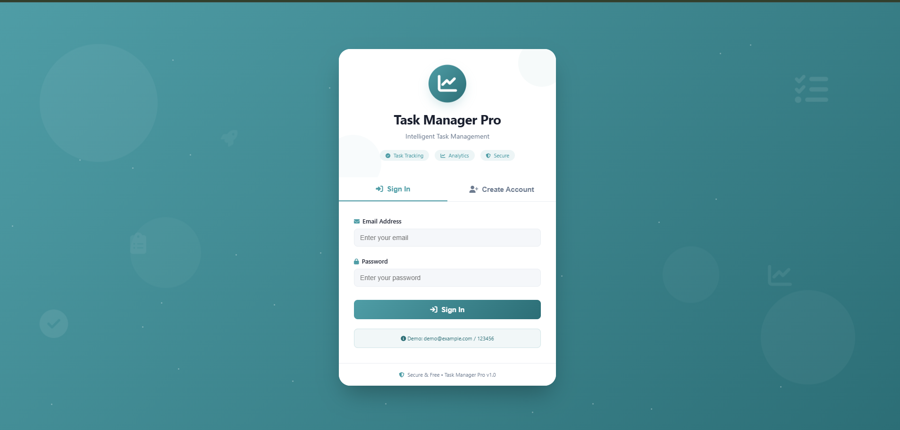
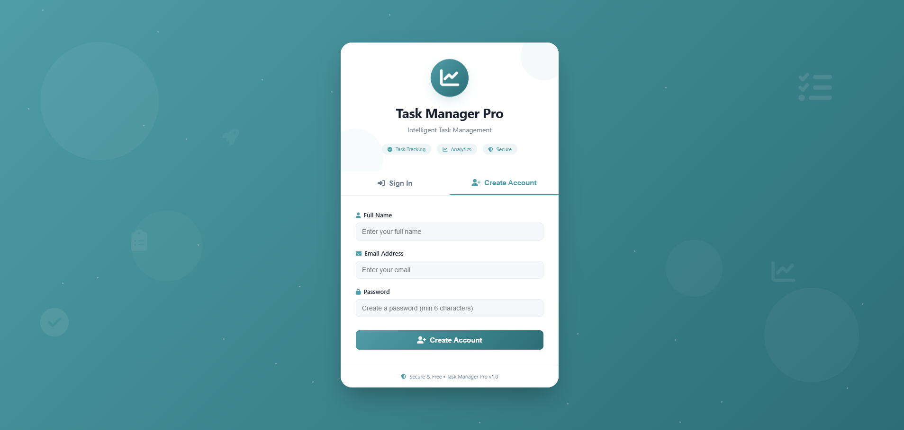
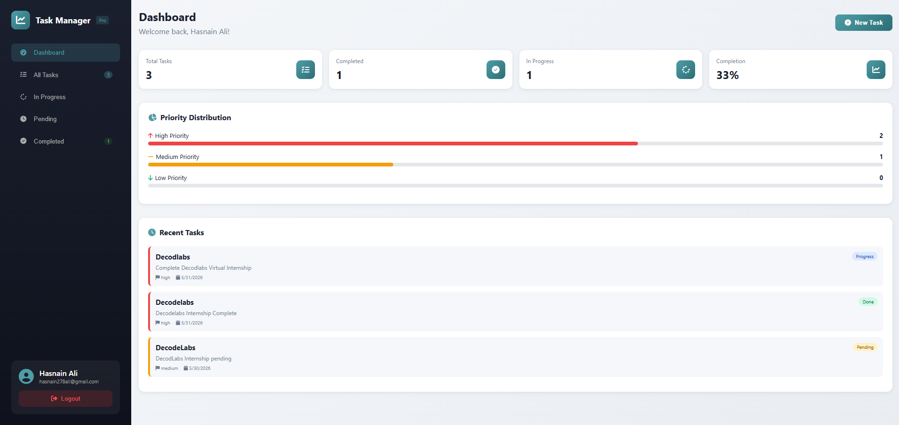
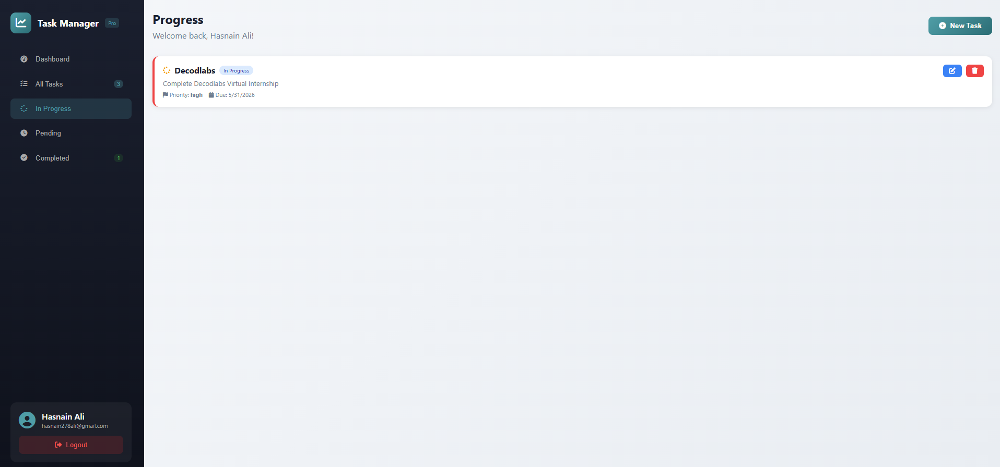
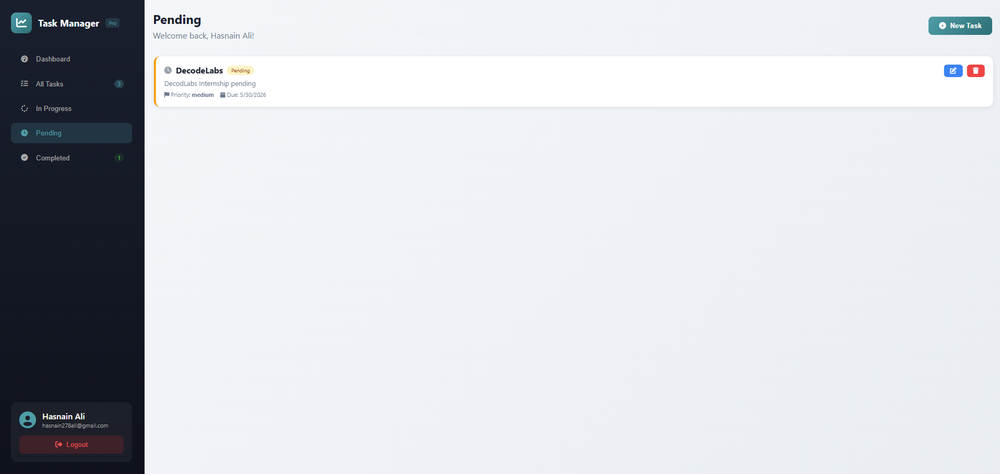
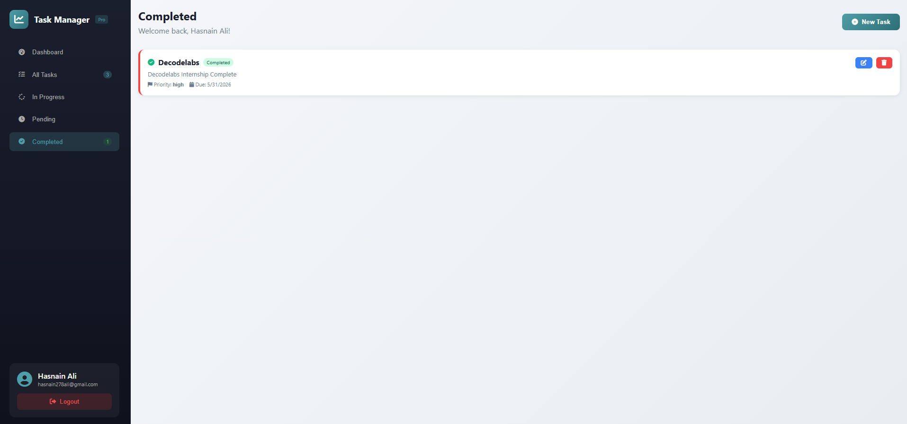

# 🚀 Task Manager Pro


## 📌 Overview

**Task Manager Pro** is a complete full-stack task management application built with **React, Node.js, Express, and TailwindCSS**. It provides a professional platform for individuals and teams to organize, track, and manage daily tasks efficiently with JWT authentication, real-time analytics, and full CRUD operations.

---

##  Screenshots

###  Authentication Pages

| Login Page | Register Page |
|------------|---------------|
|  |  |

###  Dashboard Page



###  Task Management Pages
| All Tasks  | In Progress |
|------------|---------------|
|  |  |

| Pending  | Completed |
|------------|---------------|
|  |   |


###  Create Task Modal


---

## ✨ Features

### 🔐 Authentication System
- User registration with validation
- Secure JWT token-based login
- Password encryption with bcrypt
- Persistent session storage
- Protected routes for dashboard access

### 📝 Task Management (CRUD)
- Create tasks with title, description, priority, due date
- Read all tasks with filter options
- Update any task details
- Delete tasks with confirmation modal
- Task status: Pending / In Progress / Completed
- Priority levels: Low 🟢 / Medium 🟡 / High 🔴

### 📊 Dashboard & Analytics
- Statistics cards (Total, Completed, In Progress tasks)
- Task completion rate percentage
- Priority distribution chart
- Recent activities feed
- Color-coded priority badges

### 🎨 UI/UX Highlights
- Fully responsive design for all devices
- Mobile hamburger menu sidebar
- Modal dialogs for clean forms
- Toast notifications for real-time feedback
- Professional Teal/Cyan color scheme
- Smooth animations and hover effects

---

## 🛠️ Technologies Used

| Technology | Purpose |
|------------|---------|
| **React 18** | Frontend UI framework |
| **Vite** | Build tool and dev server |
| **TailwindCSS** | Styling and responsive design |
| **Node.js** | Backend runtime environment |
| **Express.js** | RESTful API framework |
| **JWT** | Authentication & authorization |
| **bcryptjs** | Password hashing |
| **Joi** | Input validation |
| **Axios** | HTTP client for API calls |
| **React Hot Toast** | Toast notifications |

---

## 📱 Responsive Breakpoints

| Device | Breakpoint | Layout Features |
|--------|------------|-----------------|
| **Mobile** | < 768px | Single column, hamburger menu, stacked cards |
| **Tablet** | 768px - 1024px | 2 columns, optimized spacing |
| **Desktop** | > 1024px | Full layout, fixed sidebar |

---

## 📂 File Structure

```plaintext
task-manager-pro/
│
├── backend-api/                    
│   ├── controllers/                
│   │   ├── taskController.js       
│   │   └── userController.js       
│   ├── middleware/                 
│   │   ├── auth.js                 
│   │   ├── errorHandler.js         
│   │   └── validation.js           
│   ├── models/                     
│   │   ├── Task.js                 
│   │   └── User.js                 
│   ├── routes/                     
│   │   ├── tasks.js                
│   │   └── users.js               
│   ├── utils/                      
│   ├── .env                        
│   ├── package.json                
│   └── server.js                   
│
├── frontend/                       
│   ├── public/
│   │   └── index.html              
│   ├── src/
│   │   ├── components/             
│   │   │   ├── Dashboard.jsx       
│   │   │   ├── Login.jsx           
│   │   │   ├── Register.jsx        
│   │   │   ├── TaskForm.jsx        
│   │   │   └── TaskList.jsx        
│   │   ├── services/
│   │   │   └── api.js              
│   │   ├── App.jsx                 
│   │   ├── App.css                 
│   │   ├── index.css               
│   │   └── main.jsx                
│   ├── package.json                
│   ├── tailwind.config.js          
│   └── vite.config.js              
│
├── screenshots/                    
│   ├── login.png                   
│   ├── register.png                
│   ├── Dashboard.png              
│   ├── All Tasks.png               
│   ├── InProgress.png              
│   ├── Pending.png                 
│   ├── Completed.png               
│   └── Task creation.png           
│
└── README.md                       
```

---

## 🚀 Installation & Setup

### Prerequisites
```bash
Node.js (v18 or higher)
npm (v9 or higher)
```

### Step 1: Clone the repository
```bash
git clone https://github.com/hasnaainali/decodelabs_tasks/tree/main/task-manager.git
cd task-manager
```

### Step 2: Backend Setup
```bash
# Navigate to backend folder
cd backend-api

# Install dependencies
npm install

# Create .env file
echo "PORT=5000" > .env
echo "JWT_SECRET=your_secret_key_here" >> .env
echo "JWT_EXPIRE=30d" >> .env

# Start backend server
npm run dev
```
**Expected Output:** `🚀 Server running on http://localhost:5000`

### Step 3: Frontend Setup
```bash
# Open a new terminal, navigate to frontend folder
cd frontend

# Install dependencies
npm install

# Start frontend server
npm run dev
```
**Expected Output:** `VITE v5.0.0 ready ➜ Local: http://localhost:5173/`

### Step 4: Access Application
Open your browser and navigate to:
```
http://localhost:5173
```

---

## 🎯 How to Use

### Authentication Pages
- **Register**: Create new account with name, email, and password
- **Login**: Access dashboard with registered credentials

### Dashboard Page
- View statistics cards for total, completed, and in-progress tasks
- See task completion rate percentage
- Check priority distribution chart
- Review recent activities

### All Tasks Page
- View complete list of all tasks
- Filter tasks by status (All/In Progress/Pending/Completed)
- Edit or delete any task

### Create/Edit Task
- Click "Add Task" button to open modal form
- Enter task title, description, priority, and due date
- Set task status (Pending/In Progress/Completed)
- Submit to save changes

---

## 📡 API Documentation

### Authentication Endpoints

| Method | Endpoint | Description |
|--------|----------|-------------|
| POST | `/api/users/register` | Register new user |
| POST | `/api/users/login` | Login user |

### Task Endpoints (Requires Auth Token)

| Method | Endpoint | Description |
|--------|----------|-------------|
| GET | `/api/tasks` | Get all tasks |
| POST | `/api/tasks` | Create new task |
| PUT | `/api/tasks/:id` | Update task |
| DELETE | `/api/tasks/:id` | Delete task |


---

## 🎨 Color Scheme

| Color Name | Hex Code | Usage |
|------------|----------|-------|
| Primary Teal | #14b8a6 | Buttons, active states, links |
| Dark Teal | #0d9488 | Hover states, dark gradients |
| Navy Blue | #1e293b | Sidebar, headers |
| Light Gray | #f8fafc | Body background |
| White | #ffffff | Cards, forms, modals |
| Success Green | #10b981 | Completed tasks, positive status |
| Warning Yellow | #f59e0b | Medium priority, pending status |
| Error Red | #ef4444 | High priority, delete actions |
| Info Blue | #3b82f6 | In-progress status |

---

## 👨‍💻 Author

**Hasnain Ali**
