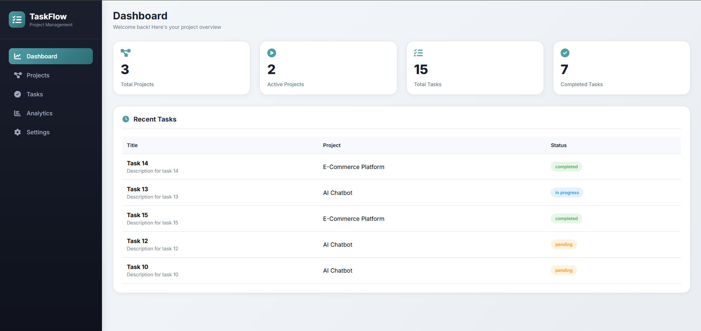
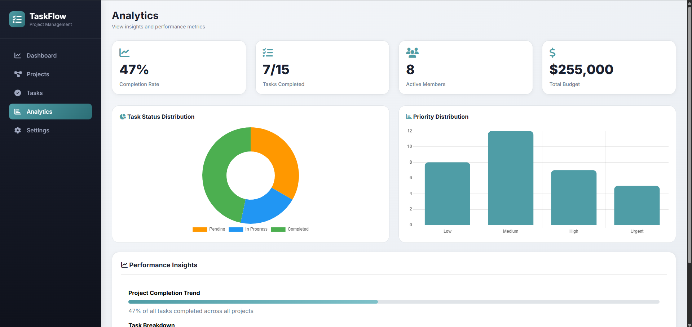
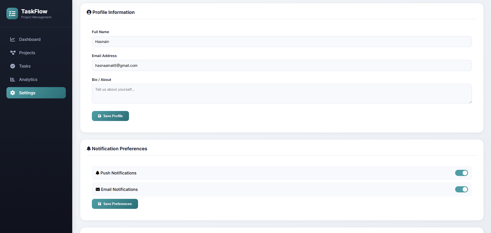
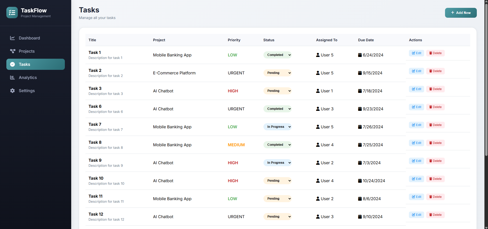
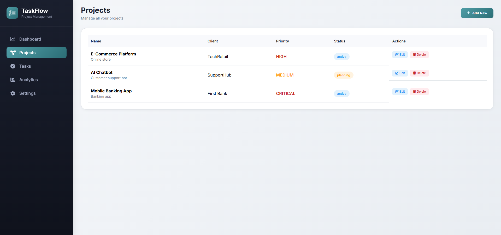

# TaskFlow Dashboard | Task Management System


## 📌 Overview

**TaskFlow Dashboard** is a full-stack task management web application built with **Node.js**, **Express.js**, **MongoDB**, and **EJS** templating engine. It provides complete CRUD operations for tasks with project management capabilities, analytics tracking, and a clean responsive dashboard interface.

---

## 📸 Screenshots

### 📊 Dashboard Views

| Dashboard | Analytics | Settings |
|-----------|-----------|----------|
|  |  |  |

### 📝 Task Management

| Tasks Page |  Task Database | Edit Task | Delete Task |
|------------|----------|-----------|-------------|
|  |  |  |  |

### 📁 Project Management

| Projects Page | Project Database |
|---------------|------------------|
|  |  |

---

## ✨ Features

| Feature | Description |
|---------|-------------|
|  **Create Tasks** | Add new tasks with title, description, priority, due date |
|  **Read Tasks** | View all tasks in an organized dashboard |
|  **Update Tasks** | Edit task details and status |
|  **Delete Tasks** | Remove tasks with confirmation |
|  **Project Management** | Create and manage multiple projects |
|  **Analytics Dashboard** | Visual insights and task statistics |
|  **Priority Levels** | Low, Medium, High priority tagging |
|  **Status Tracking** | Pending, In-Progress, Completed |
|  **Search & Filter** | Filter tasks by status and priority |
|  **Settings Page** | Configure application preferences |
|  **Responsive Design** | Works on all screen sizes |
|  **MongoDB Database** | Persistent data storage |

---

## 🛠️ Technology Stack

| Technology | Version | Purpose |
|------------|---------|---------|
| Node.js | 18.x | JavaScript runtime |
| Express.js | 4.x | Web framework |
| MongoDB | 6.x | Database |
| Mongoose | 7.x | ODM for MongoDB |
| EJS | 3.x | Templating engine |
| Dotenv | 16.x | Environment variables |
| Morgan | 1.x | HTTP logger |

---

## 📱 Responsive Breakpoints

| Device | Breakpoint | Layout Features |
|--------|------------|-----------------|
| **Mobile** | < 768px | Stacked cards, hamburger menu |
| **Tablet** | 768px - 1024px | 2 columns grid |
| **Desktop** | > 1024px | 3-4 columns grid, full layout |

---

## 📂 File Structure

```plaintext
taskflow-dashboard/
│
├── config/
│   └── database.js          
│
├── controllers/
│   ├── taskController.js    
│   └── projectController.js 
│
├── models/
│   ├── Task.js             
│   └── Project.js           
│
├── routes/
│   ├── dashboard.js         
│   ├── projects.js          
│   └── tasks.js             
│
├── views/
│   ├── dashboard.ejs           
│   ├── error.ejs         
│   
│
├── public/
│   ├── css/
│   │   └── style.css        
│   └── js/
│       └── main.js  
├── Screenshot/
│   ├── Dashboard.png          
│   ├── Projects.png         
│   └── Tasks.png 
│   ├── Analytics.png         
│   ├── Settings.png          
│   └── Edit Task.png   
│   └── Delete Task.png 
│   ├── Project Database.png         
│   ├── Task Database.png               
│
├── utils/
│   └── seedData.js          
│
├── logs/                    
├── .env                    
├── .gitignore               
├── package.json             
├── server.js               
└── README.md                
```

---

## 🚀 Installation & Setup

### Prerequisites
- Node.js (v14 or higher)
- MongoDB (local or cloud Atlas)
- npm or yarn

### Step 1: Clone the Repository
```bash
git clone https://github.com/hasnaainali/decodelabs_tasks.git
cd decodelabs_tasks/taskflow-dashboard
```

### Step 2: Install Dependencies
```bash
npm install
```

### Step 3: Configure Environment Variables
Create `.env` file in root directory:
```env
PORT=5000
MONGODB_URI=mongodb://localhost:27017/taskflow
NODE_ENV=development
```

### Step 4: Start MongoDB
```bash
# Local MongoDB
mongod

# OR using Docker
docker run -d -p 27017:27017 --name mongodb mongo:latest
```

### Step 5: Run the Application
```bash
# Development mode (with nodemon)
npm run dev

# Production mode
npm start
```

### Step 6: Open in Browser
```
http://localhost:3000/
```

---

## 🎯 How to Use

### Dashboard Page
- View all tasks and projects at a glance
- See task statistics and completion rates
- Quick access to recent activities

### Tasks Page
- Browse all tasks in organized cards
- Filter tasks by status (Pending/In-Progress/Completed)
- Filter tasks by priority (Low/Medium/High)
- Click "Add Task" to create new tasks
- Click "Edit" to modify existing tasks
- Click "Delete" to remove tasks with confirmation

### Projects Page
- View all projects in dashboard
- Create new projects with details
- Track project progress and status
- Manage project-specific tasks

### Analytics Page
- View task completion trends
- See priority distribution charts
- Track productivity metrics
- Visual data representation

### Settings Page
- Configure application preferences
- Manage user profile settings
- Adjust notification preferences

---

## 📡 API Endpoints

| Method | Endpoint | Description |
|--------|----------|-------------|
| GET | `/` | Dashboard - View all tasks |
| GET | `/add-task` | Show add task form |
| POST | `/add-task` | Create new task |
| GET | `/edit-task/:id` | Show edit task form |
| POST | `/edit-task/:id` | Update task |
| GET | `/delete-task/:id` | Delete task |
| GET | `/task/:id` | View single task details |

---

##  Database Schema

### Task Model
```javascript
{
  title: { type: String, required: true, trim: true },
  description: { type: String, required: true, trim: true },
  priority: { type: String, enum: ['low', 'medium', 'high'], default: 'medium' },
  status: { type: String, enum: ['pending', 'in-progress', 'completed'], default: 'pending' },
  dueDate: { type: Date },
  createdAt: { type: Date, default: Date.now },
  updatedAt: { type: Date, default: Date.now }
}
```

### Project Model
```javascript
{
  name: { type: String, required: true, trim: true },
  description: { type: String, trim: true },
  status: { type: String, enum: ['active', 'completed', 'archived'], default: 'active' },
  tasks: [{ type: mongoose.Schema.Types.ObjectId, ref: 'Task' }],
  createdAt: { type: Date, default: Date.now }
}
```

---

##  Color Scheme

| Color Name | Hex Code | Usage |
|------------|----------|-------|
| Primary Blue | #3b82f6 | Buttons, links, active states |
| Success Green | #10b981 | Completed tasks, success messages |
| Warning Yellow | #f59e0b | Pending tasks, warnings |
| Danger Red | #ef4444 | Delete buttons, errors |
| Dark Gray | #1f2937 | Text, headers |
| Light Gray | #f3f4f6 | Background |
| Medium Gray | #6b7280 | Secondary text |
| White | #ffffff | Cards, forms, modals |

---

##  Available Scripts

| Command | Description |
|---------|-------------|
| `npm run dev` | Start development server with nodemon |
| `npm start` | Start production server |
| `npm install` | Install dependencies |

---

## 👨‍💻 Author

**Hasnain Ali**

| Platform | Link |
|----------|------|
| GitHub | [@hasnaainali](https://github.com/hasnaainali/) |
| LinkedIn | [Hasnain Ali](https://www.linkedin.com/in/hasnaainali/) |
| Email | hasnainali5@example.com |

**Internship:** DecodLabs Virtual Full Stack Developer

---

##  License

MIT License - Free for personal and commercial use

---

##  Acknowledgments

- DecodLabs for the internship opportunity
- MongoDB for the database
- Open source contributors

---

##  Project Status

| Feature | Status |
|---------|--------|
| Task CRUD Operations |  Complete |
| Project Management |  Complete |
| Database Integration |  Complete |
| Responsive Design |  Complete |
| Search & Filter |  Complete |
| Priority Levels |  Complete |
| Due Date Tracking |  Complete |
| Analytics Dashboard |  Complete |
| Settings Page |  Complete |

**Overall Status:**  Production Ready

---

<div align="center">

**Made with ❤️ for DecodLabs Virtual Internship**

*Full Stack Task Management System*

⭐ If you found this project helpful, please give it a star on GitHub! ⭐

</div>
